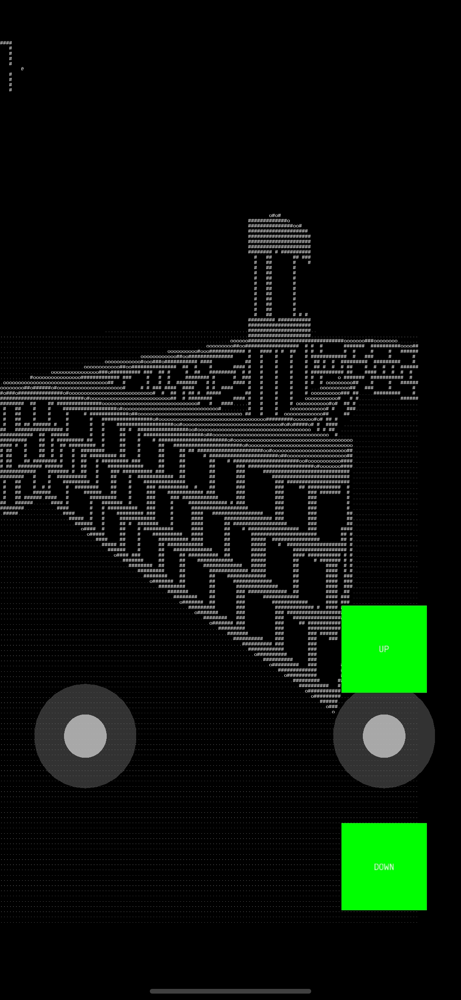
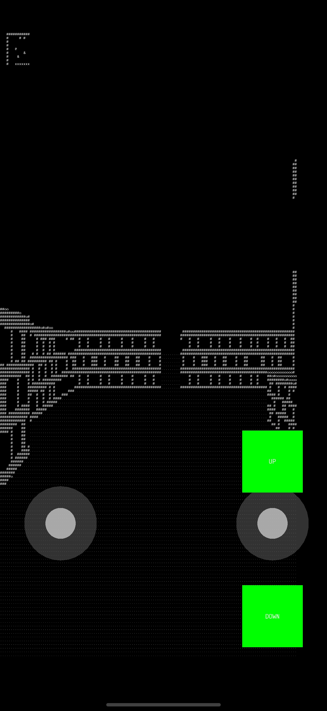

# Ascii-raycast-Doom
The project is a retro engine using raycast. The game is a 2.5D game with ascii graphics. The sfml library was used. The game implements the vertical movement of the camera, walls of different heights and drawing the floor and ceiling of the walls.

